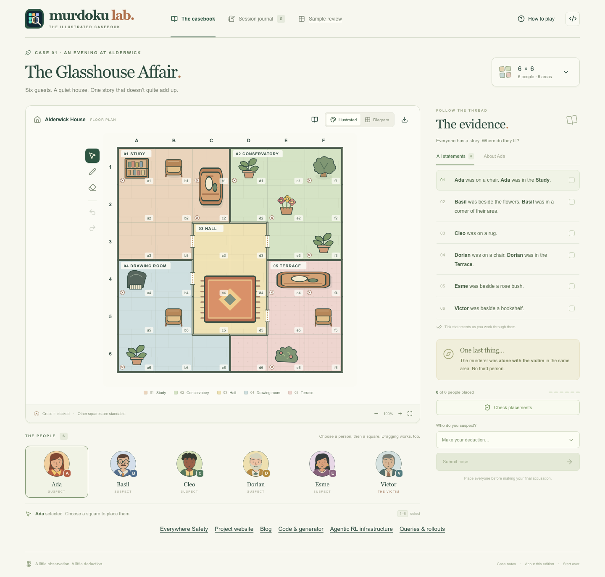
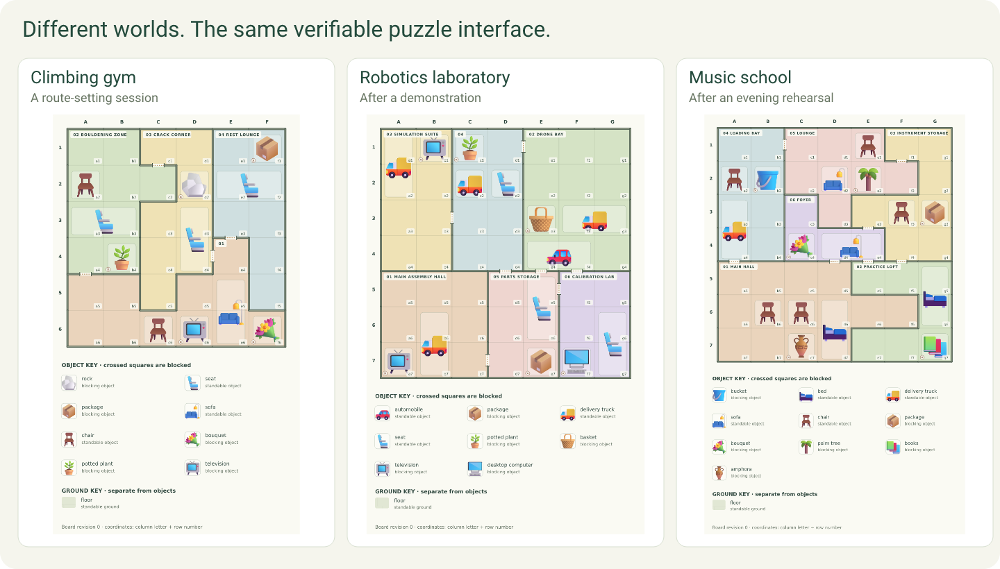
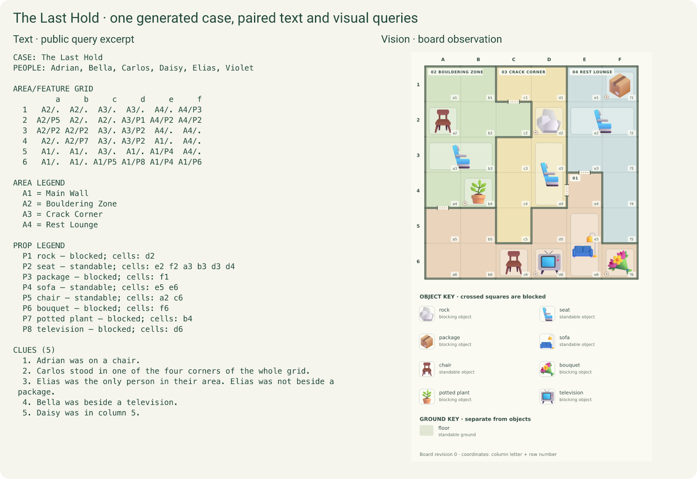

# Puzzles for people, verifiable worlds for agents

We built Murdoku Lab because detective puzzles are fun—and because they give agents rich worlds with answers we can check.

[Play a case](https://everywheresafety.github.io/murdoku/play/) · [Explore Murdoku Lab](https://everywheresafety.github.io/murdoku/) · [Code](https://github.com/EverywhereSafety/murdoku-lab) · [Queries and rollouts](https://huggingface.co/datasets/EverywhereSafety/murdoku-lab) · [Murdoku Detective 4B](https://huggingface.co/EverywhereSafety/murdoku-detective-4b) · [Agent Horizon](https://github.com/EverywhereSafety/agent-horizon)

## Give people more cases to crack

A board, a cast and a few statements are enough to start a mystery. Reconstruct where everyone stood, and find who was alone with the victim. [Murdoku, by Manuel Garand](https://murdoku.com/), makes spatial deduction feel like detective work.

Murdoku Lab brings a setter, solver and playable frontend together. Players can create new cases and inspect how their clues lead to a solution. Researchers can use the same cases as interactive tasks.

## Diversity around a solved problem

[VHD-Play](https://arxiv.org/abs/2609.27321) offers a useful construction: begin with a solved formal mechanism, then use an LLM setter to turn it into varied experiences. Murdoku Lab is one concrete instance.

The formal generator builds the board and constraints; solvers establish the unique solution. The semantic setter adds a setting, cast and wording. The environment retains the solution as a **gold reward reference**.

Settings, characters, rooms and objects broaden the experience around verified structures. Board size and constraint structure vary the deduction problem; colorful visual assets make the settings visible.

## A good puzzle has a rhythm

A promising clue gives you a way in. One discovery unlocks another, an awkward gap invites a different approach, and the final placement reveals what happened. Unique solutions give us a sound puzzle; these moments give us something to design for.

We measure that progression through deduction traces: steps to the first determined position, the longest gap without a new determination, and consecutive placement steps. The curves below show how quickly the cast becomes located as each trace unfolds.

We sampled **96 generated training cases**: 12 in each combination of board size 6–9 and medium/hard difficulty. Text and visual views count as one formal case. Values below are medians from the canonical deduction solver; the figure shows medians and the middle 50% of cases.

| Board | Difficulty | First discovery | Longest discovery gap | Longest placement chain |
| --- | --- | ---: | ---: | ---: |
| 6×6 | Medium | 4.5 | 2 | 4 |
| 6×6 | Hard | 8 | 2.5 | 4 |
| 7×7 | Medium | 4 | 3 | 3 |
| 7×7 | Hard | 5.5 | 3.5 | 3 |
| 8×8 | Medium | 2.5 | 4 | 4 |
| 8×8 | Hard | 6 | 2.5 | 3 |
| 9×9 | Medium | 2 | 5.5 | 4 |
| 9×9 | Hard | 2 | 6.5 | 5 |

The 9×9 sample starts quickly, then has longer interruptions. Opening ease and sustained progress describe different parts of the challenge. These solver measurements let us compare puzzle structures and tune their rhythm; player feedback can tell us which rhythms are enjoyable.

[Measurement definitions and sampling method](https://github.com/EverywhereSafety/murdoku-lab/blob/main/docs/reference/reasoning-profiles.md#generated-query-sample) · [Aggregate measurements](assets/puzzle-rhythm.json)

## Agents at the puzzle board

An agent can inspect the board, reason about clues, write and execute code, place characters and revise its deductions. The environment checks the final arrangement and verdict against the established solution.

Text and visual observations expose the same underlying case. This gives us a common task for studying tool use, reasoning and perception. Queries initialize fresh episodes for RL. Query + model rollout records preserve successful interactions for SFT and analysis.

All variants of a puzzle belong to the same data split. Generated cases provide training and held-out validation; official puzzles provide a separate transfer test.

## Start with a query or a solver

The [dataset](https://huggingface.co/datasets/EverywhereSafety/murdoku-lab) packages **1,410 text and visual queries** in one `query_rollouts.jsonl`, with image assets alongside it. The training split contains 698 text and 500 visual queries with successful recorded interactions; validation contains 106 cases in both views. Read `query` to initialize an RL episode, or use `rollout` for SFT and interaction analysis.

[Murdoku Detective 4B](https://huggingface.co/EverywhereSafety/murdoku-detective-4b) is a trained solver example. Serve it with its tokenizer, processor and chat template, execute its calls through the puzzle environment, and inspect how it reaches a submission.

## Separate the game from the trainer

[Murdoku Lab](https://github.com/EverywhereSafety/murdoku-lab) owns the puzzles, presentation, tools and grader. [Agent Horizon](https://github.com/EverywhereSafety/agent-horizon) owns long-horizon training on veRL: persistent state, context management, asynchronous rollout and recovery.

